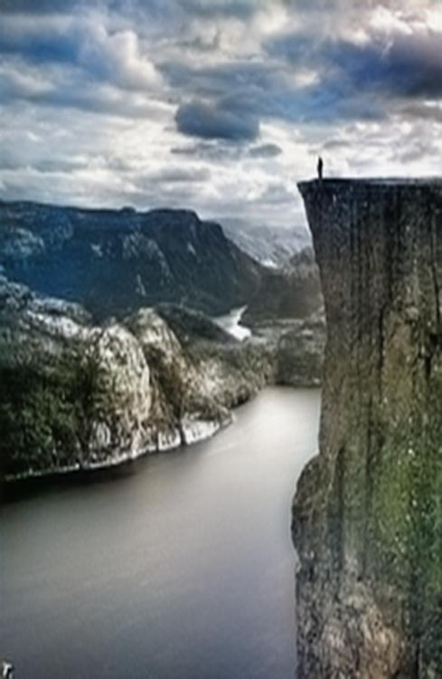
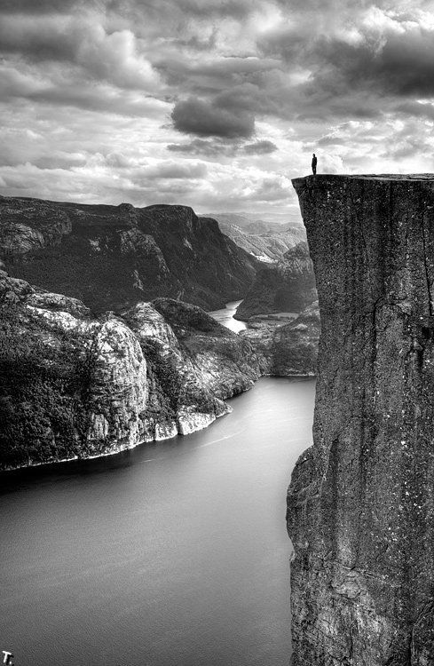
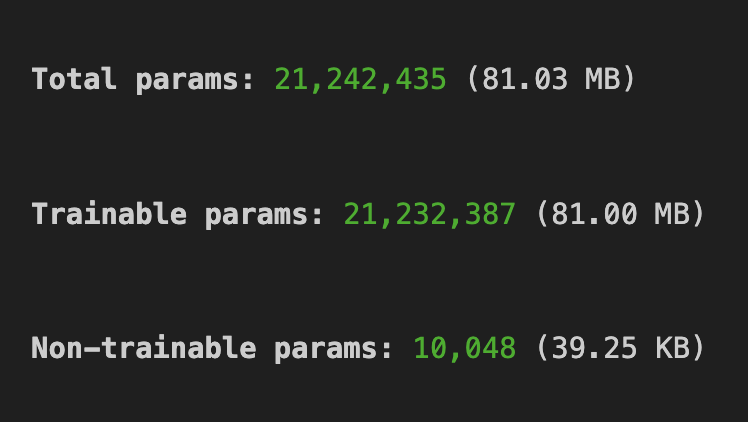
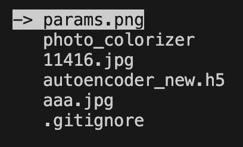

# Photo colorizer with autoencoder neural network.

    
    

#
Model of autoencoder Neural Network, which can colorize images and videoframes. It is custom autoencoder model designed and built by myselt using Tensorflow functional API. Model contains more than 21 millions of parameters and weighs 81 MB. Model was trained with this [dataset](/kaggle/input/landscape-image-colorization) in Kaggle notebook with GPU P100. You may check all parameters in "autoencoder_structure.ipynb" file. 

    

#
Here is also a program, which allows users to handle any image by model using just interface elements of console apps without code using. Running "main.py" in a folder with NN model weights, (which you may recieve, running "autoencoder_structure.ipynb" file on any data) and photo to preprocess, program will allow you to chose some photos from working folder and then, they will be automatically proprocessed by NN model and returned in the same folder.

    

#
Program uses "Curses" module as main graphical interface element. 

## Future updates
In some time this program will be also adaptated for video colorization. 

## Authors:
- Kucher Maks (maxim.kucher2005@gmail.com)
